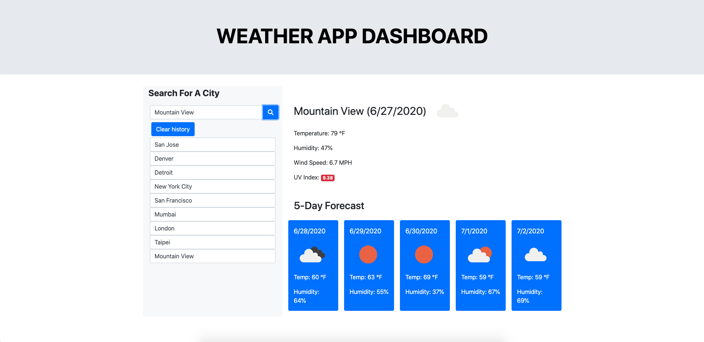

# **Work Day Scheduler**

## **Purpose**
Weather Forecast Webapp that uses js, css and html to provide users with a 5 day weather forecast for a city for their choosing.

Forecase includes -
* Date, Temperature, Humodity for 5 days
* Wind Speed and UV Index for the current day

Webapp uses OpenWeather's API to first get data on user given CITY NAME and then uses CITYID from data obtained to get 5 day forecast and LATTITUDE/LONGITUDE from data obtained to get UV Index.

## **Technologies Used**
* JAVASCRIPT
* CSS
* HTML

## **URL**
https://sparshpatwa.github.io/weather-dashboard/

## **Screenshots**

## **Status**
Deployed using GITHUB
* TODO: Implement CITY NOT FOUND for cities that the Weather API can not find.